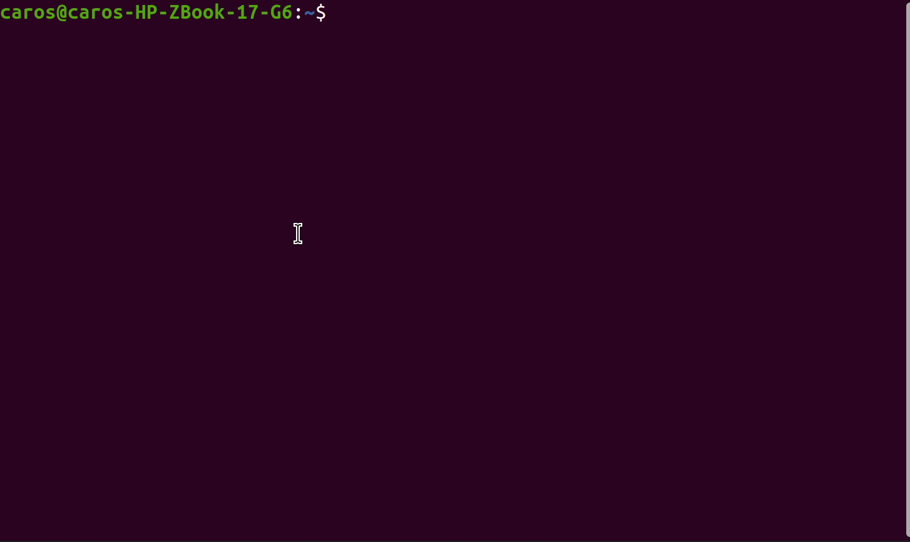
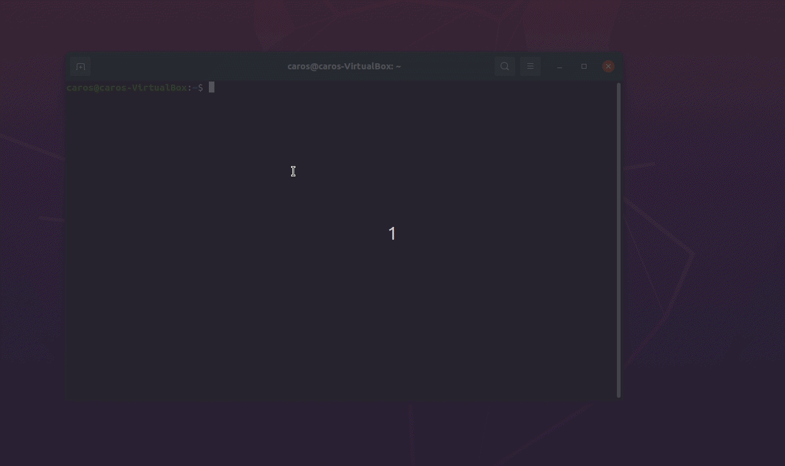

# 软件工厂
可以制造应用程序的应用程序

# 它可以干什么？
1. 使用基础模块组成应用程序
2. 使用基础模块组成更高级的模块
3. 可视化数据展示
4. 可视化程序调试
5. 可视化编程

# 为什么使用它？
1. 使用统一接口管理众多基础模块
2. 重复利用你所写过的每一个模块，而不是在你写过一个功能后，耦合到一个项目里，重新写的时候再造一次轮子
3. 足够多的基础模块的积累，在你实现新功能时可以直接写核心代码，而不是重新搞一遍环境，重新写一遍辅助代码
4. 自由的编辑器扩展，基础模块扩展和基础UI模块与界面联动打造独属于你的code style
5. 详细的使用文档和编程示例帮助带你直接上手，实现先体验后学习的良性学习反馈循环，更容易获得成就感
6. 编译或者使用过程中遇到问题，call me ^-^

# 开发/运行环境
操作系统: Ubuntu 18.04+  
开发语言：C++14

# 安装依赖
```sh
sudo apt-get install build-essential cmake
sudo apt-get install libjsoncpp-dev libprotobuf-dev protobuf-compiler libgflags-dev libgtest-dev libgoogle-glog-dev 
sudo apt-get install libsdl2-dev libglew-dev libgtk-3-dev
# ubuntu18.04需要编译安装gtest
cd /usr/src/gtest
sudo cmake CMakeLists.txt 
sudo make 
sudo cp *.a /usr/lib
```

# 构建


```sh
mkdir build
cd build
cmake ../
make
sudo make install
```

# 基础模块开发


## 创建自定义基础模块工程
```py
# 创建工程方式1(不与界面panel做交互)
python3 /opt/SoftwareFactory/tools/gen_base_mod_proj.py --type="mod" --dir="/path/to/base_mode_dir/" --name="user_define_name"
# 创建工程方式2(需要与界面panel做交互)
python3 /opt/SoftwareFactory/tools/gen_base_mod_proj.py --type="mod_with_ui" --dir="/path/to/base_mode_dir/" --name="user_define_name"
```

## 自定义模块构建和安装
```sh
mkdir build
cd build
cmake ../
make
make install
```

## 基础模块开发目录组织结构
```
|--conf
|  |--hello.json
|--proto
|  |--hello.proto
|--com
|  |--hello.cpp
|--CMakeLists.txt
```

## 自定义模块开发三步走
### (一)开发模块需要定义的函数
> 注1: FIXME 不要定义这样的函数名, 如fun, fun_some, ..., 这样会导致程序加载函数时匹配函数错误
```c++ 
// 创建变量对象函数
std::shared_ptr<::google::protobuf::Message> 
create_msg(const std::string& msg_name); 

//// 模块定义函数
// 一个输入输出参数定义
std::shared_ptr<::google::protobuf::Message> 
fun1(std::shared_ptr<::google::protobuf::Message>);
// 多个输入输出参数定义
std::vector<std::shared_ptr<::google::protobuf::Message>> 
fun2(std::vector<std::shared_ptr<::google::protobuf::Message>>);
```
### (二)开发模块需要定义的配置文件
> 注1: "_comment" 为注释行, 实际没有该字段  
> 注2: 关键字都以下划线开头
```json
{
    "_comment":"库模块名称",
    "_lib":"libbpmath.so",
    "_comment":"定义函数",
    "_func":{
        "_comment":"定义函数名add",
        "add":{
            "_comment":"定义函数输入参数",
            "_input":[
                {
                    "type":"bpmath.BpIntPair",
                    "name":"a and b"
                }
            ],
            "_comment":"定义函数输出参数",
            "_output":[
                {
                    "type":"bpbase.Int",
                    "name":"c"
                }
            ]
        }
    },
    "_comment":"该模块定义的消息",
    "_val":[
        {
            "type":"bpmath.BpIntPair",
            "desc":""
        }
    ]
}
```
### (三)开发模块需要定义的proto文件
可以自定义proto消息文件, 也可以使用基础模块已经有的proto消息文件

# 软件制作
## 编辑/导出/运行

```sh
# 打开编辑器
sudo LD_LIBRARY_PATH=/opt/SoftwareFactory/lib /opt/SoftwareFactory/bin/SoftwareFactoryEditor
# 运行编辑好的程序
sudo LD_LIBRARY_PATH=/opt/SoftwareFactory/lib /opt/SoftwareFactory/bin/bptemplate -graph_exec_file="/path/to/hello_exec.json"
```

# 界面插件开发
## 创建界面插件工程
```py
python3 /opt/SoftwareFactory/tools/gen_base_mod_proj.py --type="mod_panel" --dir="/path/to/panel_dir/" --name="user_panel_name"
```

## 界面插件构建和安装
```sh
mkdir build
cd build
cmake ../
make
make install
```

## 界面插件开发目录组织结构
```
|--panel_hello.json
|--panel_hello.cpp
|--CMakeLists.txt
```

## 界面插件开发两步走
### (一)重写panel函数
```c++ 
class panel_hello : public SFEPanel {
public:
    virtual bool Init() override {
        return true;
    }
    virtual void Update() override {
        ImGui::Begin(PanelName().c_str());

        ImGui::Button("Hello");
        
        ImGui::End();
    }
    virtual void Exit() override {

    }
    virtual void OnMessage(const SFEMessage& msg) override {

    }
};
```
### (二)修改界面插件配置文件
> 注1: "_comment" 为注释行, 实际没有该字段  
> 注2: 关键字都以下划线开头
```json
{
    "_comment":"库模块名称",
    "_lib":"libpanel_hello.so",
    "_comment":"定义插件实例",
    "_instance":[
        {
            "_comment":"实例1",
            "_comment":"定义panel对象名",
            "type":"panel_hello",
            "_comment":"定义panel实例名",
            "name":"panel_hello"
        }
    ]
}
```

# Useful example
> 基础模块工程例子：[https://github.com/lkpworkspace/bpio](https://github.com/lkpworkspace/bpio)  
> 控制界面的基础模块例子: [https://github.com/lkpworkspace/uimod_bitmap](https://github.com/lkpworkspace/uimod_bitmap)  
> 界面插件例子: [https://github.com/lkpworkspace/panel_bitmap](https://github.com/lkpworkspace/panel_bitmap)  

